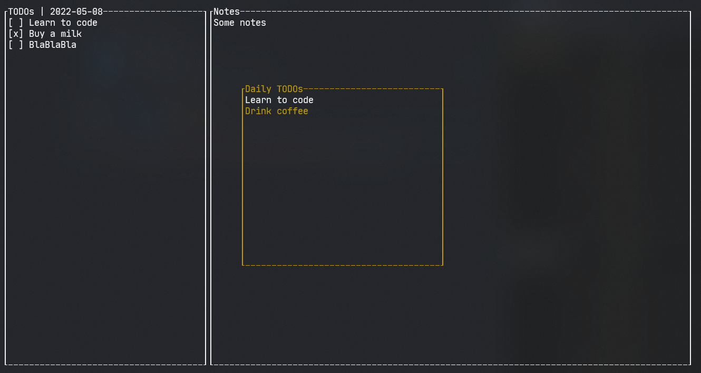
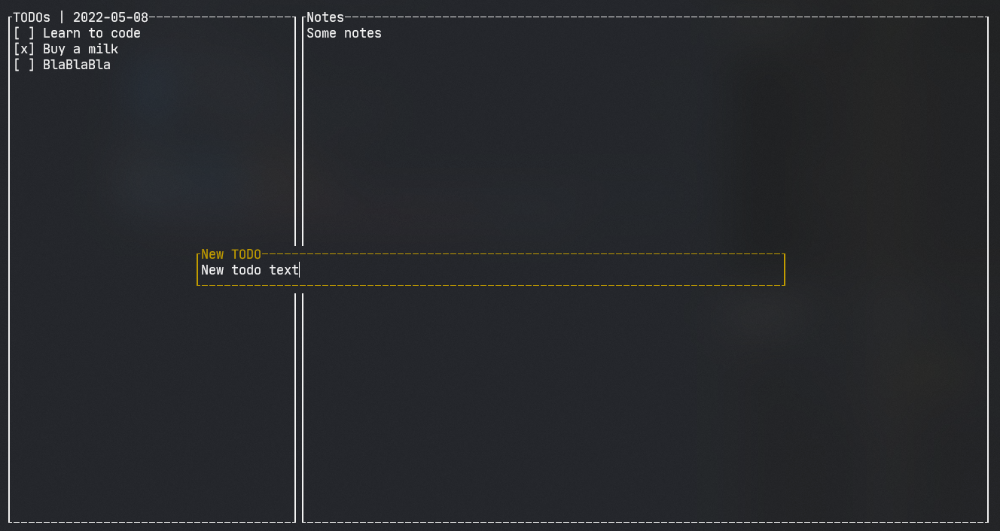

Simple todo list writen on rust.

Stored all data in sqlite database.

TODOs:

- [x] notes
- [x] daily todos
- [x] statistics 
- [ ] screens traits
- [ ] ?move to some orm?
 
UI Preview:

<kbd>Shift</kbd> + <kbd>j</kbd><kbd>k</kbd> to move task.
