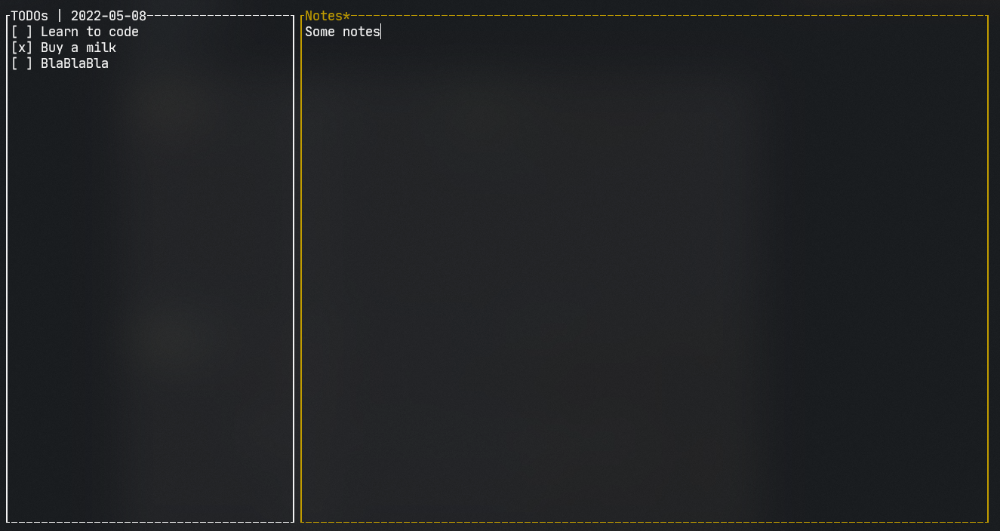

Simple todo list writen on rust.

Stored all data in sqlite database.

TODOs:

- [x] move to TUI
- [ ] daily statistics 
- [ ] default todos list
- [ ] notes
- [ ] moving tasks
 

<kbd>Shift</kbd> + <kbd>j</kbd><kbd>k</kbd> to move task.
